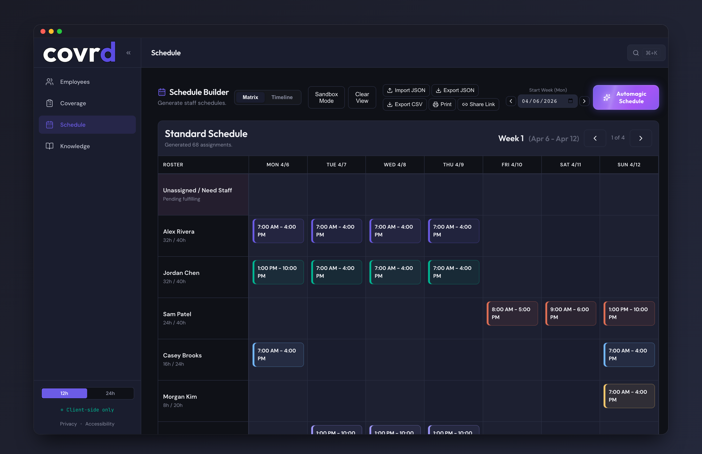
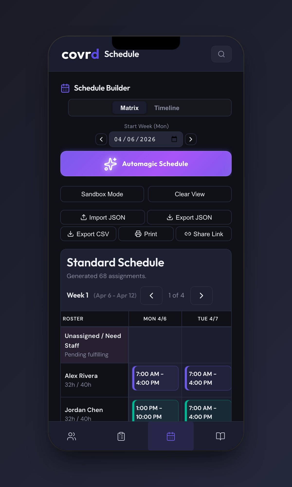

<p align="center">
  
</p>

<p align="center">
  <strong>Every shift, covrd.</strong> Auto staff scheduling that respects your privacy.
</p>

<p align="center">
  <a href="https://github.com/JoshDoesIT/covrd/actions/workflows/ci.yml"></a>
  
  
  
  
</p>

---

covrd is a **privacy-first, client-side-only** web application that automatically generates optimized staff work schedules. Your data never leaves your browser - no accounts, no servers, no tracking.

<p align="center">
  
  
</p>

## Privacy Pledge

- **Zero server-side data handling** - All data stays in your browser
- **Zero analytics or tracking** - No telemetry, no cookies
- **Zero accounts required** - No sign-up, no login
- **Full data ownership** - Export, share, or delete your data anytime

## Features

- **Smart Auto-Scheduling** - CSP solver with fairness balancing
- **Coverage Heatmap** - Instant visual staffing density
- **Recurring Templates** - Week A/B rotations, seasonal patterns
- **Schedule Quality Score** - 0-100 composite scoring
- **Command Palette** - Power-user keyboard workflow (Cmd/Ctrl+K)
- **Drag and Drop** - Manual schedule adjustments with real-time validation
- **Offline PWA** - Works without internet after first load
- **URL Sharing** - Share schedules via compressed links
- **Export** - JSON, CSV, and printable views

## Getting Started

```bash
# Clone the repository
git clone https://github.com/JoshDoesIT/covrd.git
cd covrd

# Install dependencies
npm install

# Start development server
npm run dev
```

## Development

```bash
npm run dev             # Start dev server
npm run test:run        # Run unit tests
npm run lint            # Lint code
npm run format          # Format code
npm run typecheck       # Type check
npm run build           # Production build
npm run security:code   # Snyk SAST scan
npm run security:deps   # Snyk SCA scan
npm run security        # Run all security scans
```

## Architecture

| Layer          | Technology                          |
| -------------- | ----------------------------------- |
| **UI**         | React 19 + TypeScript               |
| **Build**      | Vite 6                              |
| **State**      | Zustand                             |
| **Storage**    | IndexedDB (Dexie.js) + localStorage |
| **Scheduling** | Custom CSP solver (Web Worker)      |
| **Styling**    | Vanilla CSS (custom properties)     |
| **Testing**    | Vitest + Testing Library            |
| **Security**   | Snyk (SAST + SCA)                   |

## Brand

See [Brand Guide](docs/brand/BRAND_GUIDE.md) for the complete visual identity, color palette, typography, and component style guidelines.

## Contributing

See [CONTRIBUTING.md](CONTRIBUTING.md) for development workflow and conventions.

## Security

See [SECURITY.md](SECURITY.md) for vulnerability reporting guidelines.

## License

MIT - see [LICENSE](LICENSE) for details.
