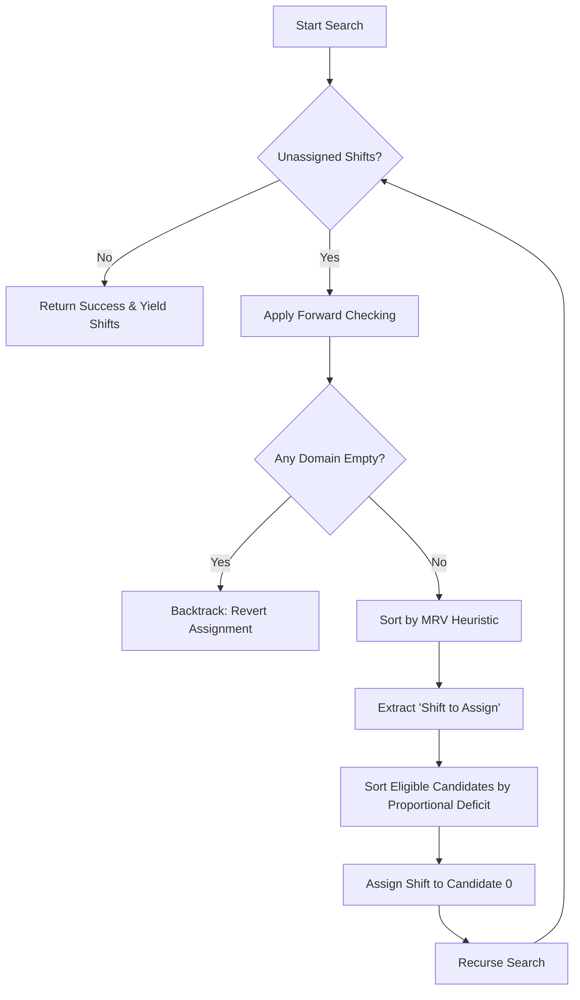

# Scheduling Engine Architecture

The core of Covrd relies on a custom Constraint Satisfaction Problem (CSP) solver built into the client suite. Because we do not rely on server-side processing, our solver processes thousands of permutations instantly within the browser using specific heuristic models.

## The Approach

When determining how to schedule shifts fairly across different employee availability constraints, I had to start off by deciding which approach balanced speed and fairness best. I ended up deciding on a **Backtracking Search** modified by forward checking.

To make this execution consistently performant, our recursive search applies two critical heuristics:

### 1. Minimum Remaining Values (MRV)

The MRV heuristic sorts shifts so the **hardest to fill** (the ones with the fewest eligible candidates) are solved first.

- We evaluate the domain of available employees for every unassigned shift.
- The shift with the smallest domain gets assigned immediately.
- If we encounter a "domain wipeout" (a shift with 0 candidates), we instantly prune that execution branch and backtrack.
- Longer duration shifts act as a tie-breaker because they inherently constrain the remaining weekly hours of a chosen employee.

### 2. Proportional Deficit Fairness Model

Once the shift is chosen, we must decide _who_ takes it. Previously, the engine utilized a "raw hour deficit approach" (Target Weekly Hours - Current Scheduled Hours). However, that created inequitable environments between part-time workers (Target: 20 hours) and full-time workers (Target: 40 hours).

We moved to a **Proportional Deficit Model** to handle part-time employees equitably.
In this model, the deficit is normalized to a 0.0 - 1.0 scalar:

```typescript
const proportionalDeficit = (targetHours - scheduledHours) / targetHours
```

A part-time employee at 0/20 hours (100% proportional deficit) has equal priority to a full-time employee at 0/40 hours (100% proportional deficit).

### Additional Fairness Operations

In addition to hours, we provide massive algorithmic rewards and penalties based on repeating structures:

- **Clumping Constraints**: We drastically penalize assigning a single isolated shift (e.g. creating a "one day on, one day off" workflow). We heavily reward extending block shifts.
- **Consistency Constraints**: The engine prioritizes employees working a given shift if they already work that precise day inside another week. This incentivizes naturally recurring Week A/Week B patterns.

## Execution Flow

The following sequence highlights the recursive solver process executed for every potential schedule block:



_Note: In the event that a schedule is completely impossible given current constraints, the engine gracefully times out and returns the highest-yielding "Partial Assignment" it found during backtracking._
