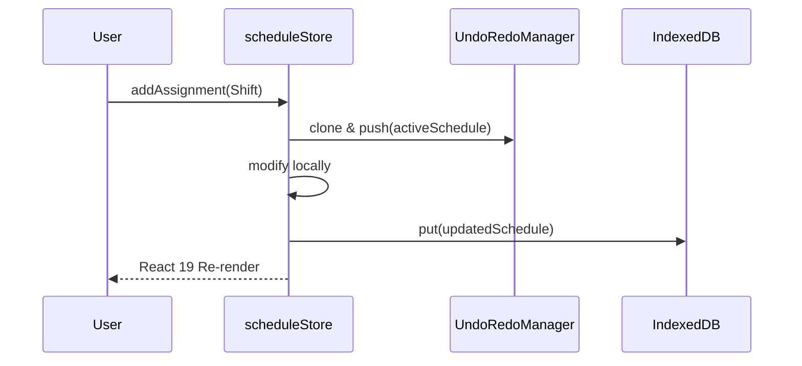

# State Management Architecture

Covrd requires robust client-side state management since we strictly prohibit server telemetry or external data tracking. I decided to utilize **Zustand** due to its un-opinionated reactivity and simple hook integration within React 19.

Our two primary stores are `scheduleStore` and `employeeStore`. They serve as our authoritative source of truth at runtime.

## The Workflow

The core lifecycle of state inside our application involves three layers:

1. **Local Disk (IndexedDB)**: Ensures persistence across hard reloads through Dexie.js (`covrdDb`).
2. **Memory (Zustand)**: Serves rapid reactivity across the UI layer and hooks.
3. **Undo/Redo Stack**: Manages non-destructive edits without database collisions.

### Database Hydration

Because our UI needs to be synchronized with whatever was previously on the employee's machine, we must trigger an explicit hydration loop when the application first mounts. Component wrappers utilize `useEffect` to query IndexedDB on load, format the instances, and inject them into Zustand using the unified `.hydrate()` method available on both stores.

### The Undo/Redo Manager

When detailing the shift assignment logic, we must explicitly acknowledge user error occurs frequently. To solve this, `scheduleStore` incorporates a custom `UndoRedoManager`.

When a schedule assignment modification occurs (e.g. `addAssignment` or `removeAssignment`), the _entire_ active schedule object is cloned and pushed to the Undo manager's stack _before_ the modification updates the Store.

If the user hits `Undo`, we retrieve the cloned object, forcefully inject it into `activeSchedule`, and then overwrite the database model directly.

### Sandbox Isolation

We provide users a "Sandbox Mode", allowing them to drag and drop shifts without physically destroying their baseline data.

- The `enableSandbox` action shallow copies `activeSchedule` into a separate `baselineSchedule` buffer.
- During Sandbox mode, `undo`/`redo` functionality continues flawlessly over the sandbox execution limits.
- `commitSandbox` simply clears the baseline cache, while `discardSandbox` overwrites the active schedule with what is inside the baseline cache.

It is important to note that capturing this specific sandbox separation now will prevent accidental regressions in the future when dealing with complex multi-week shifts.
